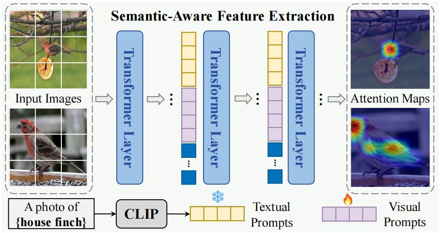
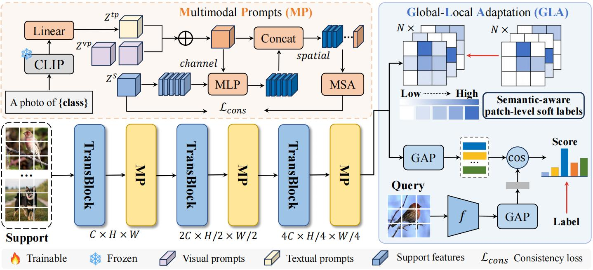

# Semantic-Aware Adaptation with Hierarchical Multimodal Prompts for Few-Shot Learning

# Method
Despite being annotated as "house finch", the image contains objects of other classes, such as "branch", "Pipe", etc. Moreover, target objects could appear at different scales, leading to varying numbers of noisy regions. Our SAA achieves class-specific feature extraction guided by multimodal prompts and robustness to spatial variations via hierarchical structure.



**Overall framework**




## Requirements
Listed in `requirements.txt` Install with：
```
pip install -r requirements.txt
```
The code was tested with Python 3.8.1 and Pytorch >= 1.7.0.
We experimented on a single GEFORCE RTX 4090. 
The minimum GPU memory is 24GB. 

### Scripts
#### Pre-train the backbone
* miniImageNet
```
python pretrain.py --gpu 0 --dataset miniImageNet 
```

#### Meta-tune the model
* miniImageNet
```
1-shot: python meta.py --gpu 0 --dataset miniImageNet --shot 1
5-shot: python meta.py --gpu 0 --dataset miniImageNet --shot 5 
```

#### Test
* miniImageNet
```
1-shot: python test_meta.py --gpu 0 --dataset miniImageNet --shot 1
5-shot: python test_meta.py --gpu 0 --dataset miniImageNet --shot 5 
```
